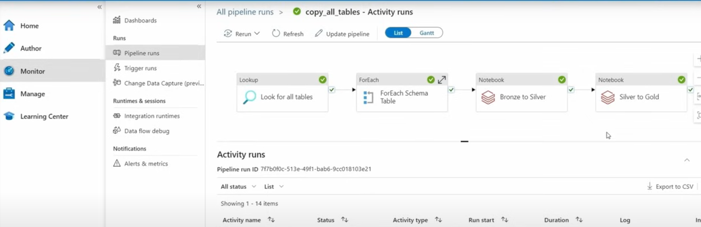
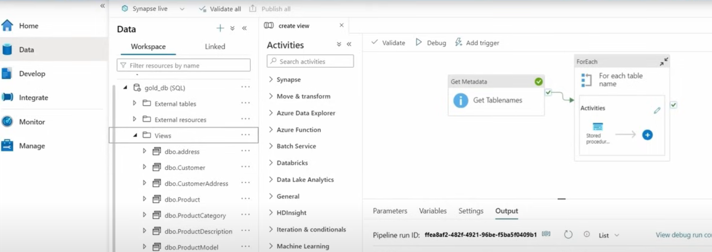

# Data_Migration_Azure
A data migration project involves transferring data from one system, format, or storage location to another. This process is often undertaken when organizations upgrade systems, consolidate data, move to the cloud, or modernize legacy infrastructure. 
•	Migrated structured data from on-premise SQL Server (SSMS) to Azure Data Lake & Synapse for cloud modernization.

•	Analysed business and technical requirements, mapping documents, and transformation rules for accurate migration.

•	Created & executed ETL test cases to validate extraction, transformation, and loading processes.

•	Performed source-to-target reconciliation (row count, duplicates, constraints, metadata validation) ensuring 100% accuracy.

•	Automated backend validation using SQL & Python scripts, reducing manual effort.

•	Validated Azure Data Factory (ADF) pipelines for full load and incremental load scenarios.

•	Collaborated with developers, BAs, and data engineers to resolve migration defects and retest fixes.

•	Tested & verified BI reports in Power BI, ensuring correct KPIs and business insights post-migration.

## 1: Data Ingestion

Data ingestion from the on-premises SQL server to Azure SQL is accomplished via Azure Data Factory. The process involves:

## 2: Data Transformation

After ingesting data into the "bronze" folder, it is transformed following the medallion data lake architecture (bronze, silver, gold). Data transitions through bronze, silver, and ultimately gold, suitable for business reporting tools like Power BI.

Azure Databricks, using PySpark, is used for these transformations. Data initially stored in parquet format in the "bronze" folder is converted to the delta format as it progresses to "silver" and "gold." This transformation is carried out through Databricks notebooks:

1. Mount the storage.
2. Transform data from "bronze" to "silver" layer.
3. Further transform data from "silver" to "gold" layer.

Azure Data Factory is updated to execute the "bronze" to "silver" and "silver" to "gold" notebooks automatically with each pipeline run.

## 3: Data Loading

Data from the "gold" folder is loaded into the Business Intelligence reporting application, Power BI. Azure Synapse is used for this purpose. The steps involve:

1. Creating a link from Azure Storage (Gold Folder) to Azure Synapse.
2. Writing stored procedures to extract table information as a SQL view.
3. Storing views within a server-less SQL Database in Synapse.

## 4: Data Reporting

Power BI connects directly to the cloud pipeline using DirectQuery to dynamically update the database.

## 5: Final Pipeline Test

To verify the end-to-end pipeline, two new customers are added to the local SQL database server. If successful, the pipeline will update, and the Power BI report will dynamically show the new data. The total number of customers should increase from 847 to 849.

## Conclusion and Limitations

This project demonstrates the ability to create an end-to-end ETL cloud solution using Azure. Some considerations:

- The dataset used was small (7mb total, 900 rows). This was done to keep compute + storage costs low for myself.
- Multiple applications were employed for a relatively simple task.
- Given the dataset's simplicity, the project could have been managed entirely through Azure Data Factory, with data cleaning done downstream in Power BI.
- The inclusion of Azure Synapse and Databricks was for the sake of self-learning and emulating real-world business pipelines.
